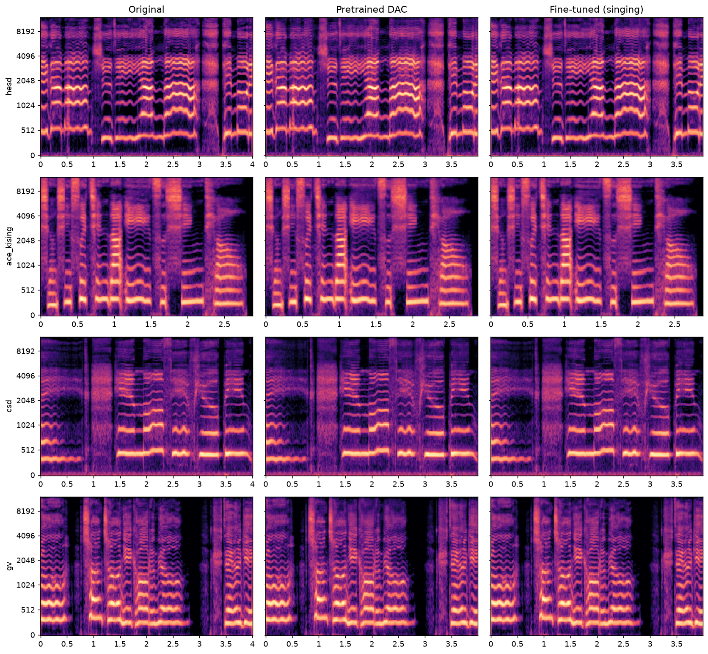

# Singing-finetuned-DAC

Fine-tuned weights of the **Descript Audio Codec (DAC) 24 kHz** for **singing voice**.

> **No architecture changes.** This is the official pretrained DAC 24 kHz model,
> further trained (full fine-tune) on a large singing-voice corpus. The goal is better
> reconstruction of singing — especially **high pitch range, vibrato, and F0 fidelity** —
> which the original general-purpose DAC handles less well because it saw very little
> a-cappella singing during training.

**Research / non-commercial use only** (see [License](#license)).

---

## Why

The official DAC 24 kHz is a *universal* codec trained on a speech / music / general-audio
mix. Its singing content is tiny (≈10 h of a-cappella VocalSet + a few hours of
accompanied vocals in MUSDB18). Singing has wide pitch range and vibrato that a
general codec reconstructs imperfectly. Fine-tuning on ~470 h of (mostly monophonic)
singing adapts the encoder/decoder/quantizer to this domain.

This codec is the backbone of a Singing Voice Conversion pipeline: `wav → DAC latent
z (B, 1024, T) @ 75 Hz → (manipulate) → DAC decode → wav`, so reconstruction quality
upper-bounds the whole system.

## Results

Measured on a fixed held-out evaluation set (identical clips before/after), using
[`scripts/eval_quality.py`](scripts/eval_quality.py). Lower ↓ / higher ↑ is better.

| Metric | Pretrained DAC | Fine-tuned | Δ |
|---|---:|---:|---|
| Mel distance ↓ | _TBD_ | _TBD_ | _TBD_ |
| MCD (dB) ↓ | _TBD_ | _TBD_ | _TBD_ |
| **F0 RMSE (cents) ↓** | _TBD_ | _TBD_ | _TBD_ |
| **F0 correlation ↑** | _TBD_ | _TBD_ | _TBD_ |
| PESQ ↑ | _TBD_ | _TBD_ | _TBD_ |
| STOI ↑ | _TBD_ | _TBD_ | _TBD_ |

*(Numbers filled in after training completes.)*

### Mel-spectrogram comparison



*Original vs. pretrained-DAC reconstruction vs. fine-tuned reconstruction. Note the
high-frequency / harmonic detail in sustained notes. (generated by
[`scripts/plot_mel.py`](scripts/plot_mel.py))*

## Usage

Install the codec library and download the weights, then:

```python
import dac
from audiotools import AudioSignal

# load fine-tuned weights (single-file export; see Releases / HF Hub link below)
model = dac.DAC.load("dac_singing_finetune.pth").eval().to("cuda")

signal = AudioSignal("song.wav").resample(24000).to_mono()
x = model.preprocess(signal.audio_data.cuda(), 24000)
z, codes, latents, _, _ = model.encode(x)   # z: (B, 1024, T) @ ~75 Hz
y = model.decode(z)                          # reconstructed waveform
```

> Weights are hosted separately (not in this Git repo) — see the
> **[Weights](#weights)** section.

## How it was fine-tuned

- **Base**: `descript-audio-codec` 24 kHz, 8 kbps (`weights_24khz_8kbps_0.0.4`),
  74.7 M-param generator, RVQ 32×1024 (dim 8), hop 320 (~75 Hz latent).
- **Strategy**: full fine-tune (encoder + decoder + quantizer) resumed from the
  pretrained generator. The official release ships no discriminator, so the
  discriminator (MPD + MRD + MSD) is **re-initialized and warmed up** from scratch.
- **Key hyper-parameters** ([`conf/singing_24khz.yml`](conf/singing_24khz.yml)):
  batch 16, 3 s segments, AdamW lr 1e-4 (betas 0.8/0.99), ExponentialLR γ=0.999996,
  loss λ = {mel 15, feat 2, gen 1, vq-commit 0.25, vq-codebook 1.0}, 200 k steps.
- **Hardware**: single NVIDIA RTX PRO 6000 (Blackwell, sm_120), PyTorch 2.11 + CUDA 12.8.

### Compatibility patches (new PyTorch ↔ older DAC toolchain)
Training the 2023-era DAC code on a Blackwell GPU (which needs CUDA 12.8+) required
three small patches — documented in [`docs/PATCHES.md`](docs/PATCHES.md):
1. `argbind` — handle PyTorch's `lr: float | Tensor` union annotation.
2. `audiotools` — `soundfile` fallback for the removed `torchaudio.info` legacy API.
3. DAC `train.py` — length-align recon/target before spectral losses when the segment
   length is an exact multiple of the hop.

## Data

~472 h total, all converted to 24 kHz mono, 5 % held out for validation. Long full-song
recordings were split into 30 s chunks. **Audio is not redistributed here** (see license).

| Dataset | Lang | Hours (train) | License |
|---|---|---:|---|
| MSSV | Korean | 228.8 | internal |
| GV | Korean | 143.3 | internal |
| ACE-KiSing | Chinese | 30.0 | CC BY-NC 4.0 |
| M4Singer | Chinese | 28.2 | CC BY-NC-SA 4.0 |
| HESD | Korean | 14.0 | internal |
| CSD | Korean/English | 4.6 | CC BY-NC-SA 4.0 |

See [`scripts/DATASETS.md`](scripts/DATASETS.md) for download instructions for the
public datasets. (`opencpop` was excluded — its CC BY-NC-ND license forbids derivatives.)

## Reproduce

```bash
# 1. preprocess any audio to 24 kHz mono (resamples; --segment_sec splits long songs)
python scripts/preprocess.py --in_dir <raw> --out_dir data/train/public/<name> --jobs 64 [--segment_sec 30]
# 2. train/val split (5% per dataset)
python scripts/make_split.py --root data --val_ratio 0.05
# 3. fine-tune (resumes from pretrained generator)
bash scripts/train.sh
# 4. evaluate before/after on a fixed set
python scripts/eval_quality.py --ckpt pretrained        --out runs/eval/baseline.json  --build_manifest runs/eval/manifest.json
python scripts/eval_quality.py --ckpt runs/.../best     --out runs/eval/finetuned.json --manifest runs/eval/manifest.json
python scripts/eval_quality.py --compare runs/eval/baseline.json runs/eval/finetuned.json
```

## Weights

Hosted on the Hugging Face Hub (not in this Git repo): **_link TBD_**

## License

**Research / non-commercial use only.** The fine-tuning data includes CC BY-NC /
CC BY-NC-SA datasets and internal (non-redistributable) corpora, so the resulting
weights inherit non-commercial terms. The DAC code/architecture is MIT
(© Descript). Do not use these weights in commercial products.

## Acknowledgements

- [Descript Audio Codec](https://github.com/descriptinc/descript-audio-codec) (Kumar et al., NeurIPS 2023)
- Public datasets: ACE-KiSing (ESPnet), M4Singer, CSD — thanks to their authors.

## Citation

This work is a fine-tune of the **Descript Audio Codec**; please cite the original paper:

```bibtex
@inproceedings{kumar2023high,
  title     = {High-Fidelity Audio Compression with Improved {RVQGAN}},
  author    = {Kumar, Rithesh and Seetharaman, Prem and Luebs, Alejandro and
               Kumar, Ishaan and Kumar, Kundan},
  booktitle = {Advances in Neural Information Processing Systems (NeurIPS)},
  year      = {2023}
}
```

If you use these fine-tuned weights, please also link this repository.

### Dataset references
- **M4Singer** — Zhang et al., *M4Singer: A Multi-Style, Multi-Singer and Musical Score Provided Mandarin Singing Corpus*, NeurIPS 2022.
- **CSD** — Choi et al., *Children's Song Dataset for Singing Voice Research*, ISMIR 2020.
- **ACE-KiSing / Opencpop** — see the [ESPnet](https://github.com/espnet/espnet) singing recipes.
